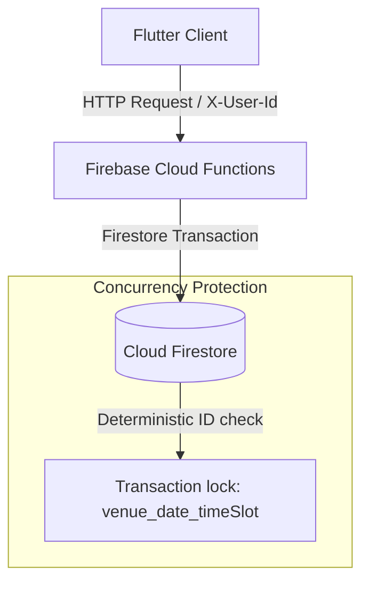

# QuickSlot 🏟️

QuickSlot is a premium mini-app for booking sports venues (badminton courts and turf grounds) with strict concurrency safety (preventing double-bookings), real-time background polling, offline read caching for active bookings, and a strict Clean Architecture layout.

---

## Project Structure

This is a monorepo structured as:
* **`/server`**: Node.js Express API. Can run locally on port 5000, inside a Docker container, or deployed directly to **Firebase Cloud Functions**.
* **`/app`**: Flutter mobile application using `flutter_bloc` and `freezed`.

---

## Architecture Diagram



### Backend Concurrency Approach
The one hard rule is that a slot can never be double-booked. To guarantee this, we execute bookings inside a **Firestore Transaction** using a deterministic booking document ID in the format: `${venueId}_${date}_${timeSlot}`. 
1. When a booking request is made, the transaction checks if a document with that ID already exists in the `bookings` collection.
2. If it exists, the transaction is immediately aborted, throwing a conflict error. The server returns HTTP `409 Conflict`.
3. If it doesn't exist, the transaction writes the booking document containing the user details, date, time slot, and venue name. The server returns HTTP `201 Created`.
Because Firestore transactions run atomically, if two requests hit the backend at the exact same instant, only one will succeed, while the other is rejected with `409 Conflict`.

### Flutter Architecture
The app follows **Strict Clean Architecture** divided into `core` and distinct features:
* **Core:** Centrally houses error models, HTTP API client, and reusable loading, error, and empty state widgets.
* **Features (`auth`, `venues`, `slots`, `bookings`):** Each feature is cleanly segregated into:
  * **Domain Layer:** Entities, repository contracts, and use cases.
  * **Data Layer:** Models (Freezed + JSON serialization), remote data sources, and repository implementations.
  * **Presentation Layer:** Blocs (state machines translating events to UI states) and responsive, high-fidelity UI pages.

---

## Setup & Running

### Part A — Backend (`/server`)

#### Option 1: Deploying to Firebase Cloud Functions (Recommended)
This will host your server on Firebase and generate a public API URL.

1. Install the Firebase CLI globally:
   ```bash
   npm install -g firebase-tools
   ```
2. Log in to your Firebase account:
   ```bash
   firebase login
   ```
3. Initialize/bind your project. Navigate to the root directory `quickslot/` and run:
   ```bash
   firebase use --add
   ```
   *Select your active Firebase project from the list and give it an alias (e.g., `default`).*
4. Deploy the Express API to Cloud Functions:
   ```bash
   firebase deploy --only functions
   ```
5. Once deployment is complete, Firebase will output your function's public URL:
   ```text
   ✔  functions[us-central1-api]: Successful update operation.
   Function URL (api): https://us-central1-YOUR_PROJECT_ID.cloudfunctions.net/api
   ```
   *Copy this URL. You will paste this as the `backendBaseUrl` in the Flutter client.*

#### Seeding the Live Firestore Database
To seed the venues into your live Cloud Firestore:
1. Generate a Service Account private key JSON from your Firebase Console (Project Settings > Service Accounts).
2. Save it inside the `/server` directory as **`firebase-service-account.json`**.
3. Navigate to `/server` and run:
   ```bash
   npm run seed
   ```

---

#### Option 2: Running Locally (Node.js)
1. Save your `firebase-service-account.json` key inside `/server`.
2. Navigate to `/server`:
   ```bash
   cd server
   ```
3. Install dependencies and run in dev mode:
   ```bash
   npm install
   & npm run dev
   ```
   *The local server runs on port 5000.*

#### Option 3: Running inside Docker
1. Build and run:
   ```bash
   docker build -t quickslot-server .
   docker run -p 5000:5000 -v "%cd%/firebase-service-account.json:/usr/src/app/firebase-service-account.json" quickslot-server
   ```

---

### Part B — Flutter Client (`/app`)

1. Navigate to `/app`:
   ```bash
   cd app
   ```
2. Fetch dependencies:
   ```bash
   flutter pub get
   ```
3. Generate model files (Freezed & JSON Serializer):
   ```bash
   dart run build_runner build --delete-conflicting-outputs
   ```
4. Verify tests:
   ```bash
   flutter test
   ```
5. Configure your API endpoint in **`lib/main.dart`**:
   * Change `backendBaseUrl` to your deployed Firebase Cloud Function URL:
     ```dart
     const String backendBaseUrl = 'https://us-central1-YOUR_PROJECT_ID.cloudfunctions.net/api';
     ```
6. Run the app:
   ```bash
   flutter run
   ```

---

## Scope Decisions (What We Cut & Why)

1. **Full Authentication:** We cut full sign-up/login authentication (e.g., OTP or passwords) and used a profile select screen passing an `X-User-Id` header. This allowed us to focus effort on the transaction safety of the booking grid and clean architecture.
2. **WebSockets:** We used clean, periodic HTTP polling (every 5 seconds) instead of a custom WebSocket server to fetch slot status updates. This is extremely robust, matches the requirements, and avoids maintaining complex WebSocket socket connections on the server side.

---

## What We'd Do with One More Day

1. **Real-time Firestore Listeners:** Instead of HTTP polling, we would utilize Firebase's native `snapshots()` listener to push instantaneous UI slot status updates to the Flutter app without server overhead.
2. **Integration Tests:** Write a comprehensive suite of Flutter integration tests executing the booking flow automatically using a mock driver.

---

## AI Usage Note

* **What we used AI for:** AI was used to generate data models, scaffold clean architecture folders, write unit tests for the Bloc, and formulate the concurrency simulation test.
* **One thing it got wrong that we caught and fixed:** The AI tried to use `Colors.emerald` in the Flutter presentation widgets, which failed compilation because `emerald` is not defined in Flutter's Material `Colors` library. We caught this compilation error during testing and replaced it with a set of custom Tailwind-equivalent hex colors (`const Color(0xFF10B981)` for emerald green) to maintain the premium visuals.
